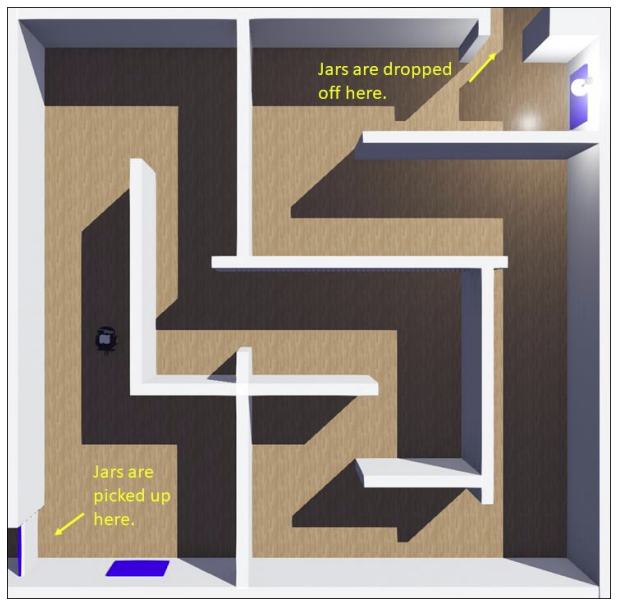

# README.md

## The Goal of Project

**The overall goal of this project is to get 3 robots to work together to deliver a set of 5 jars from the bottom-left quadrant of the environment to specific locations in the top left quadrant.** 

### Zone 2

- **The robot’s code must be written in ProjectController2.java which has some
code already written to get you started.**
- **The robot MUST NOT use a GPS nor a Supervisor class nor anything that gives
the robot’s location or orientation directly. If you want to know the (x,y) position at
any time, you will have to compute it yourself. The compass can be used to
obtain the orientation.**
- **The robot has a laser range finder that can be used, whereas the other two
robots do not have this sensor.**
- **The robot MUST pick up each jar from the bottom left then drop it off at the top
right corner so that the robot in Zone 3 can pick it up.**
- **The robot MUST NOT travel into Zone 1 NOR Zone 3 at any time …its body is
allowed to go into either zone up to half its body length at most.**
- **Once the robot has completed dropping off 5 jars, it should stop running with a
System.exit(0); call.**